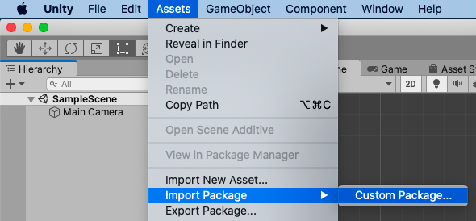
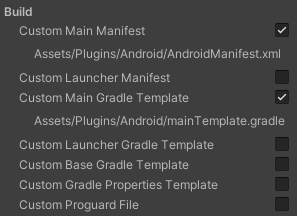
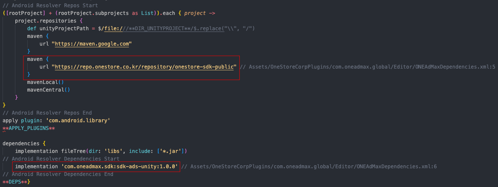

# Unity 에서 원스토어 광고 SDK 사용하기

## 전제조건

* Unity 2020.3 이상 사용
* Android SDK 버전
  * Minimum API Level 16 이상 사용
  * Target API Level 31 이상 사용


Android API 레벨은 Project Settings > Player > Other Settings 에서 설정할 수 있습니다.


## ONEAdMax for Unity 플러그인 다운로드

ONEAdMax for Unity 플러그인을 사용하면 Unity 개발자가 원스토어 광고를 제공할 수 있습니다.

Java 코드를 작성할 필요없이 Android 앱에서 사용할 수 있습니다.

이 플러그인은 Unity에서 광고를 요청하기 위한 C# 인터페이스를 제공합니다.

다음 링크를 사용하여 플러그인용 Unity 패키지를 다운로드 하거나 사용할 수 있고, Github를 통해 코드를 공개합니다.

<mark style="color:blue;">\[Github Release 주소]</mark>

### ONEAdMax for Unity 플러그인 가져오기

Unity 메뉴 바에서 Assets > Import Package > Custom Package를 클릭합니다.

<figure><figcaption></figcaption></figure>

**`Assets/OneStoreCorpPlugins/com.oneadmax.global`** 폴더가 생성됩니다.

> [EDM4U(External Dependency Manager for Unity)](https://github.com/googlesamples/unity-jar-resolver)가 필수로 같이 배포됩니다.\
> 만약, 이미 사용하고 있다면 `Import Package` 단계에서 `ExternalDependencyManager` 를 체크해지 하고 적용하면 됩니다.

### 외부 종속성 포함

프로젝트에 레파지토리 및 종속성이 포함되도록 하려면 다음 단계를 따릅니다.

**`Project Settings > Player > Publishing Settings > Build`**

아래의 두 가지를 체크합니다.

* Custom Main Manifest
* Custom Main Gradle Template

<figure><figcaption></figcaption></figure>

**`Assets > External Dependency Manager > Android Resolver > Force Resolve`** 를 선택합니다.

`mainTemplete.gradle` 파일에 아래와 같이 적용되는 것을 확인 할 수 있습니다.

<figure><figcaption></figcaption></figure>


ONEAdMax for Unity 플러그인 종속성은 다음에 나열되어 있습니다.

Assets/OneStoreCorpPlugins/com.oneadmax.global/Editor/ONEAdMaxDependencies.xml


## APP key 발급 및 적용하기

<mark style="color:red;">// TODO 해당 링크 달아주세요!</mark>

앱키를 발급 받았다면 `AndroidManifest.xml`에 `<meta-data />`를 설정해야 합니다.

```xml
<manifest>
    ...
    <application>
        ...
        <activity android:name="com.unity3d.player.UnityPlayerActivity">
            ...
        </activity>

        <meta-data android:name="com.oneadmax.global.appkey" android:value="your app key"/>
    </application>
</manifest>
```

## 미디에이션 설정

[<mark style="color:red;">// 미디에이션 설정 방법 링크</mark>](https://wiki.onestorecorp.com/display/ONEIAA/ONE+AdMax+SDK#ONEAdMaxSDK-%EB%AF%B8%EB%94%94%EC%97%90%EC%9D%B4%EC%85%98\(Mediation\))

## SDK에 적용된 사항들

### Permission

```xml
<manifest>
    ...
    <uses-permission android:name="android.permission.INTERNET" />
    <uses-permission android:name="android.permission.ACCESS_NETWORK_STATE" />
    ...
</manifest>
```

### 네트워크 보안 구성

Android 9부터 일반 텍스트 트래픽(암호화되지 않은 HTTP)은 기본적으로 차단됩니다. 이로 인해 미디어 캐싱 기능이 영향을 받게 되며 사용자 경험과 광고 매출도 영향을 받을 수 있습니다.\
`ONEAdMax`는 이러한 영향을 완화하기 위해 SDK 내에 네트워크 보안 구성 파일을 포함하고 있습니다.

이와 관련된 자세한 내용은 [안드로이드 네트워크 보안 구성 페이지](https://developer.android.com/training/articles/security-config?hl=ko)를 참고하시기 바랍니다.

## SDK 초기화

광고를 로드하기 전에 앱이 ONEAdMax를 초기화 해야합니다.\
`ONEAdMaxClient.Initialize()` 초기화는 최초 한 번만 수행해야 합니다.

다음은 ONEAdMaxClient 를 초기화 하는 방법입니다.

```csharp
...
using ONEAdMax;
...
public class ONEAdMaxDemo : MonoBehaviour
{
    private static bool _isInitialized = false;
    
    void Start()
    {
        if (!_isInitialized)
        {
            // Initialize the ONEAdMax SDK.
            ONEAdMaxClient.Initialize(() =>
            {
                // This callback is called once the ONEAdMax SDK is initialized.
                _isInitialized = true
            });
        }
    }
}
```

### 로그 설정

개발을 위해 ONEAdMax의 자세한 로그를 노출할 수 있습니다. (기본값: false)

```csharp
ONEAdMaxClient.SetLogEnable(true);
```

### GDPR 설정

EU의 GDPR (General Data protection Regulation) 법안에 대응하기 위해 아래 API를 추가 합니다.\
GDPR 동의가 필요한 유저에 한해 아래 API를 호출하시기 바랍니다. (기본값: true)

```csharp
ONEAdMaxClient.GdprConsentAvailable(true);
```

### 어플리케이션 종료

어플리케이션이 종료될 때 메모리에 할당된 리소스( View, Memory )를 해제합니다.

```csharp
void OnApplicationQuit()
{
    ONEAdMaxClient.Destroy();
}
```

## 광고 형식 선택하기

이제 광고를 구현할 준비가 되었습니다. ONEAdMax 는 다양한 광고 형식을 제공하므로 만들 수 있는 광고 형식을 선택할 수 있습니다.

### 배너 광고

배너 광고는 앱의 일부를 차지하는 직사각형 광고를 표시합니다.\
위치를 설정하고 시간을 설정하여 자동으로 새로고침할 수 있습니다.

[banner-view.md](README/banner-view.md "mention")

### 전면 광고

전면 광고는 앱의 화면 전체를 덮는 광고입니다.\
완료 되었거나 유저의 의해 중단 되었을 경우 앱의 화면으로 전환됩니다.

[interstitail-ad.md](README/interstitail-ad.md "mention")

### 전면 동영상 광고

전면 광고와 동일하지만 이미지가 아닌 영상이 노출됩니다.\
영상을 로드하는 과정이 `전면 광고`보다 오래 소요될 수 있습니다.

[interstitial-video-ad.md](README/interstitial-video-ad.md "mention")

### 보상형 동영상 광고

보상을 제공하는 비디오 광고 입니다.\
비디오 광고 종료시 Complete event callback 으로 광고 참여 완료 정보를 전달합니다.

[rewarded-video-ad.md](README/rewarded-video-ad.md "mention")
